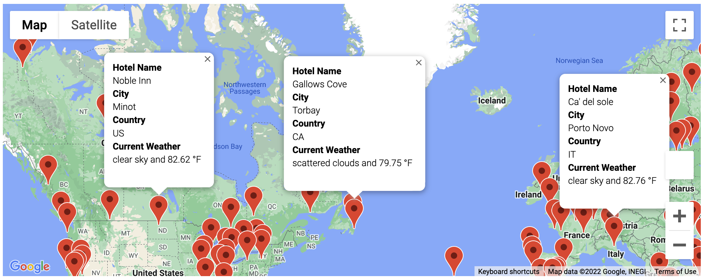
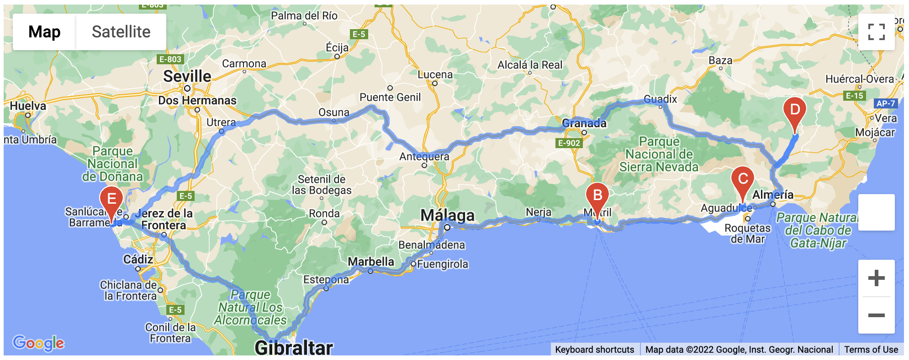

# World Weather Analysis

## Overview
In this project, I performed data analysis, visualization, and statistical skills by retrieving data from APIs and analyzing weather data for a hypothetical travel search engine. I utilized Python, decision and repetition statements, data structures, Pandas, Matplotlib, and SciPy Statistics to successfully complete my objectives. This work is displayed in the 'WeatherPy.ipynb' and 'VacationPy.ipynb' files.

Furthermore, I enhanced the project by again retrieving data from the Open Weather and Google Maps APIs to create a new city-based weather database with a new feature: 'current description' of the weather. I then used gmaps to create an interactive map with pop-up markers for every city in the database, showing markers based on user inputed search criteria. Additionally, I created a vacation itinerary based on a close cluster of destinations (Spain used in the example). The itinerary includes a map with a highlighted driving directions route, and an additional map with pop-up markers decribing the itinerary destinations' weather.   

## Weather_Database
I used the numpy library to generate 2000 random latitude-longitude pair coordinates. From these 2000 random coordinate-pairs, I used the citipy module to create a list of unique city names for cities nearest to each random coordinate-pair generated. The resulting cities list contained 739 unique cities. I then used the Open Weather API to retrieve weather data (if available) for each city in the list (resulted 592 cities with weather data). Below is a table displaying a sample output (first 10 rows) of the resulting city-based weather database (saved as 'WeatherPy_Database.csv')

__WeatherPy Database__
|City_ID|City              |Country|Lat     |Lng      |Max Temp|Humidity|Cloudiness|Wind Speed|Current Description        |
|-------|------------------|-------|--------|---------|--------|--------|----------|----------|---------------------------|
|0      |Xichang           |CN     |27.8964 |102.2634 |63.27   |92      |4         |2.01      |light rain                 |
|1      |Rikitea           |PF     |-23.1203|-134.9692|70.43   |63      |51        |21.7      |broken clouds              |
|2      |Carnarvon         |AU     |-24.8667|113.6333 |59.49   |57      |0         |13.89     |clear sky                  |
|3      |Udachnyy          |RU     |66.4167 |112.4    |52.45   |81      |100       |21.85     |overcast clouds            |
|4      |Gunnedah          |AU     |-30.9833|150.25   |47.71   |97      |43        |7.78      |scattered clouds           |
|5      |Carquefou         |FR     |47.2982 |-1.4902  |68.07   |55      |0         |10.36     |clear sky                  |
|6      |Butaritari        |KI     |3.0707  |172.7902 |81.61   |75      |77        |10.09     |broken clouds              |
|7      |Baherden          |TM     |38.4362 |57.4316  |88.09   |22      |1         |6.78      |clear sky                  |
|8      |Pangnirtung       |CA     |66.1451 |-65.7125 |39.2    |100     |100       |6.91      |light rain                 |
|9      |Tautira           |PF     |-17.7333|-149.15  |76.71   |78      |97        |25.97     |light rain                 |
 

## Vacation_Search
I created user inputed search criteria to filter the weather dataframe by minimum and maximum temperature desired for vacation destination. I inputed the search criteria for city desinations where the minimum temperature desired was 60.0 F° and the maximum temperature desired was 90.0 F°. There were 404 resulting city destinations without any missing data values. I then used the Google Maps API to search for the nearest hotel to each city coordinate-pair and saved the resulting weather database with the hotel name found for each city (367 cities with hotel names found). Below is a table displaying a sample output (first 10 rows) of the hotel and vacation weather database (saved as 'WeatherPy_vacation.csv')

__WeatherPy Vacation Database__
|City_ID|City              |Country|Max Temp|Current Description |Lat     |Lng      |Hotel Name                                                                         |
|-------|------------------|-------|--------|--------------------|--------|---------|-----------------------------------------------------------------------------------|
|0      |Xichang           |CN     |63.27   |light rain          |27.8964 |102.2634 |Xichang ibis Hotel                                                                 |
|1      |Rikitea           |PF     |70.43   |broken clouds       |-23.1203|-134.9692|People ThankYou                                                                    |
|5      |Carquefou         |FR     |68.07   |clear sky           |47.2982 |-1.4902  |Best Western Plus Hôtel de la Régate                                               |
|6      |Butaritari        |KI     |81.61   |broken clouds       |3.0707  |172.7902 |Isles Sunset Lodge                                                                 |
|9      |Tautira           |PF     |76.71   |light rain          |-17.7333|-149.15  |Pension Oaoa                                                                       |
|10     |Karavayevo        |RU     |73.26   |clear sky           |55.2961 |37.9622  |Individual House-Sauna                                                             |
|15     |Tuktoyaktuk       |CA     |65.66   |clear sky           |69.4541 |-133.0374|End of The Road Ltd.                                                               |
|16     |Mayumba           |GA     |68.47   |broken clouds       |-3.432  |10.6554  |LIKWALE LODGE                                                                      |
|18     |Victoria          |HK     |81.32   |overcast clouds     |22.2855 |114.1577 |Mini Central                                                                       |
|19     |Nouadhibou        |MR     |70.75   |clear sky           |20.931  |-17.0347 |El Medina                                                                          |

 
I then used the gmaps module to create a map of the global vacation-city destinations with pop-up markers for each of the 367 cities with the matching hotel name. A sample section of the map with pop-up markers displayed is shown below.
 
 

__WeatherPy Vacation Map__

 
 

## Vacation_Itinerary
Next, I created a feature for the hypothetical search engine where the user may choose four cities within the same country from the list of potential travel destinations to create a travel iternary for. The iternary will include weather information and markers on a map showing the destinations locations. Additionally, the itinerary will contain driving directions for a roadtrip looping back to the starting city destination, using the remainder 3 cities as waypoints for stops. A sample of a vacation itinerary for four cities in Spain, from our potential cities list, is displayed in the maps (created using gmaps) below.

__WeatherPy Travel Map (Vacation Roadtrip Directions)__

__WeatherPy Travel Map (Vacation Destination Markers__)
